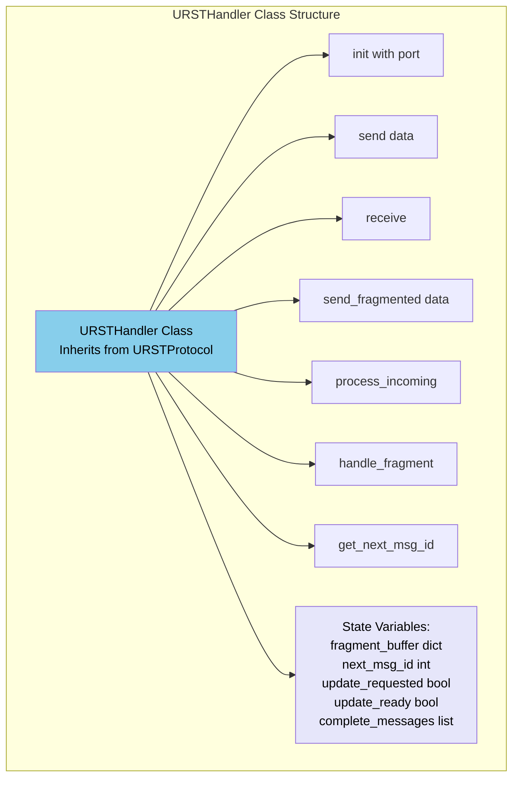
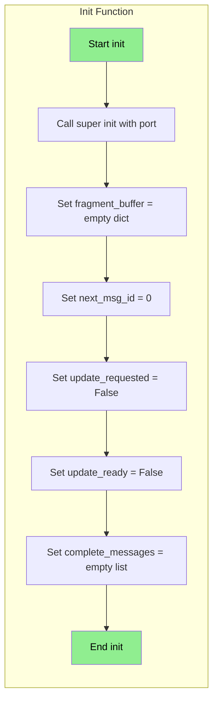
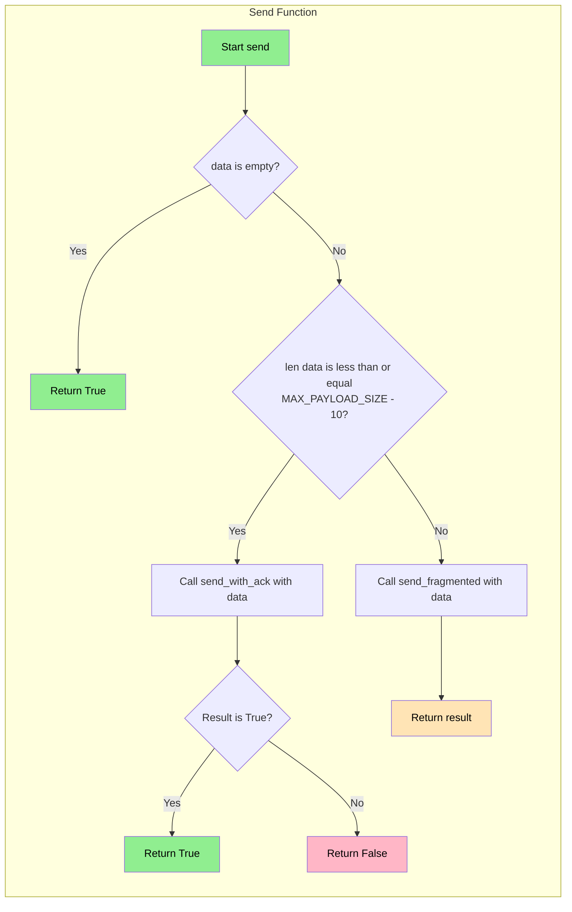
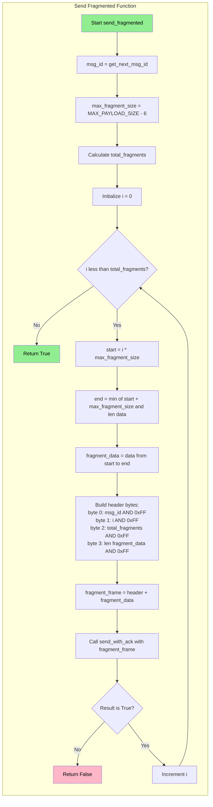
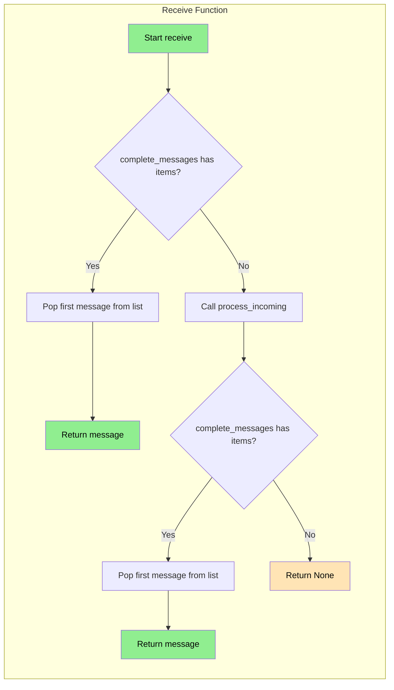
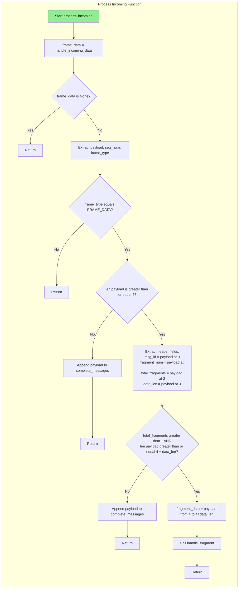
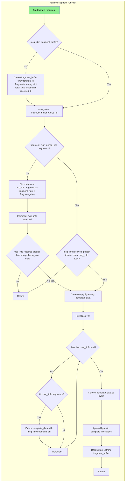
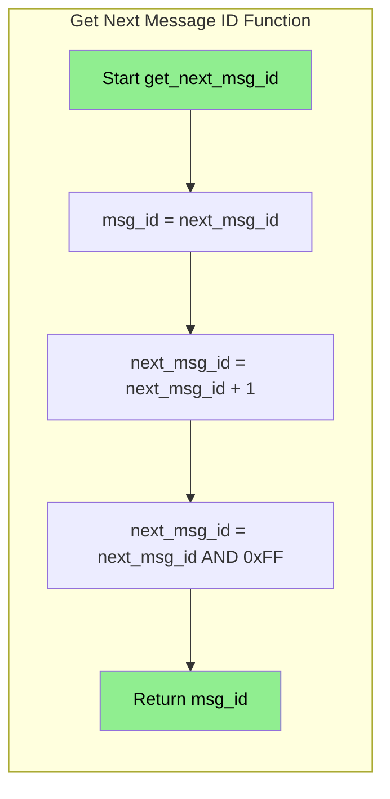

```mermaid
flowchart
    subgraph ClassStructure[URSTHandler Class Structure]
        Class[URSTHandler Class<br/>Inherits from URSTProtocol]
        Class --> InitMethod[init with port]
        Class --> SendMethod[send data]
        Class --> ReceiveMethod[receive]
        Class --> SendFragMethod[send_fragmented data]
        Class --> ProcessMethod[process_incoming]
        Class --> HandleFragMethod[handle_fragment]
        Class --> GetMsgIDMethod[get_next_msg_id]

        Class --> StateVars[State Variables:<br/>fragment_buffer dict<br/>next_msg_id int<br/>update_requested bool<br/>update_ready bool<br/>complete_messages list]
    end
    style Class fill:#87CEEB,color:#000000
    style StateVars fill:#E6E6FA,color:#000000
```

```mermaid
flowchart BT
    subgraph Init[Init Function]
        I1[Start init] --> I2[Call super init with port]
        I2 --> I3[Set fragment_buffer = empty dict]
        I3 --> I4[Set next_msg_id = 0]
        I4 --> I5[Set update_requested = False]
        I5 --> I6[Set update_ready = False]
        I6 --> I7[Set complete_messages = empty list]
        I7 --> I8[End init]
    end
    style I1 fill:#90EE90,color:#000000
    style I8 fill:#90EE90,color:#000000
```

```mermaid
flowchart BT
    subgraph Send[Send Function]
        S1[Start send] --> S2{data is empty?}
        S2 -->|Yes| S3[Return True]
        S2 -->|No| S4{len data is less than or equal<br/>MAX_PAYLOAD_SIZE - 10?}
        S4 -->|Yes| S5[Call send_with_ack with data]
        S5 --> S6{Result is True?}
        S6 -->|Yes| S7[Return True]
        S6 -->|No| S8[Return False]
        S4 -->|No| S9[Call send_fragmented with data]
        S9 --> S10[Return result]
    end
    style S1 fill:#90EE90,color:#000000
    style S3 fill:#90EE90,color:#000000
    style S7 fill:#90EE90,color:#000000
    style S8 fill:#FFB6C6,color:#000000
    style S10 fill:#FFE4B5,color:#000000
```

```mermaid
flowchart BT
    subgraph SendFrag[Send Fragmented Function]
        SF1[Start send_fragmented] --> SF2[msg_id = get_next_msg_id]
        SF2 --> SF3[max_fragment_size = MAX_PAYLOAD_SIZE - 6]
        SF3 --> SF4[Calculate total_fragments]
        SF4 --> SF5[Initialize i = 0]
        SF5 --> SF6{i less than total_fragments?}
        SF6 -->|No| SF7[Return True]
        SF6 -->|Yes| SF8[start = i * max_fragment_size]
        SF8 --> SF9[end = min of start + max_fragment_size and len data]
        SF9 --> SF10[fragment_data = data from start to end]
        SF10 --> SF11[Build header bytes:<br/>byte 0: msg_id AND 0xFF<br/>byte 1: i AND 0xFF<br/>byte 2: total_fragments AND 0xFF<br/>byte 3: len fragment_data AND 0xFF]
        SF11 --> SF12[fragment_frame = header + fragment_data]
        SF12 --> SF13[Call send_with_ack with fragment_frame]
        SF13 --> SF14{Result is True?}
        SF14 -->|No| SF15[Return False]
        SF14 -->|Yes| SF16[Increment i]
        SF16 --> SF6
    end
    style SF1 fill:#90EE90,color:#000000
    style SF7 fill:#90EE90,color:#000000
    style SF15 fill:#FFB6C6,color:#000000
```

```mermaid
flowchart BT
    subgraph Receive[Receive Function]
        R1[Start receive] --> R2{complete_messages has items?}
        R2 -->|Yes| R3[Pop first message from list]
        R3 --> R4[Return message]
        R2 -->|No| R5[Call process_incoming]
        R5 --> R6{complete_messages has items?}
        R6 -->|Yes| R7[Pop first message from list]
        R7 --> R8[Return message]
        R6 -->|No| R9[Return None]
    end
    style R1 fill:#90EE90,color:#000000
    style R4 fill:#90EE90,color:#000000
    style R8 fill:#90EE90,color:#000000
    style R9 fill:#FFE4B5,color:#000000
```

```mermaid
flowchart BT
    subgraph Process[Process Incoming Function]
        P1[Start process_incoming] --> P2[frame_data = handle_incoming_data]
        P2 --> P3{frame_data is None?}
        P3 -->|Yes| P4[Return]
        P3 -->|No| P5[Extract payload, seq_num, frame_type]
        P5 --> P6{frame_type equals FRAME_DATA?}
        P6 -->|No| P7[Return]
        P6 -->|Yes| P8{len payload is greater than or equal 4?}
        P8 -->|No| P9[Append payload to complete_messages]
        P9 --> P10[Return]
        P8 -->|Yes| P11[Extract header fields:<br/>msg_id = payload at 0<br/>fragment_num = payload at 1<br/>total_fragments = payload at 2<br/>data_len = payload at 3]
        P11 --> P12{total_fragments greater than 1 AND<br/>len payload greater than or equal 4 + data_len?}
        P12 -->|No| P13[Append payload to complete_messages]
        P13 --> P14[Return]
        P12 -->|Yes| P15[fragment_data = payload from 4 to 4+data_len]
        P15 --> P16[Call handle_fragment]
        P16 --> P17[Return]
    end
    style P1 fill:#90EE90,color:#000000
```

```mermaid
flowchart BT
    subgraph HandleFrag[Handle Fragment Function]
        HF1[Start handle_fragment] --> HF2{msg_id in fragment_buffer?}
        HF2 -->|No| HF3[Create fragment_buffer entry for msg_id:<br/>fragments: empty dict<br/>total: total_fragments<br/>received: 0]
        HF3 --> HF4[msg_info = fragment_buffer at msg_id]
        HF2 -->|Yes| HF4
        HF4 --> HF5{fragment_num in msg_info fragments?}
        HF5 -->|Yes| HF6{msg_info received greater than or equal msg_info total?}
        HF5 -->|No| HF7[Store fragment:<br/>msg_info fragments at fragment_num = fragment_data]
        HF7 --> HF8[Increment msg_info received]
        HF8 --> HF9{msg_info received greater than or equal msg_info total?}
        HF9 -->|No| HF10[Return]
        HF9 -->|Yes| HF11[Create empty bytearray complete_data]
        HF6 -->|No| HF10
        HF6 -->|Yes| HF11
        HF11 --> HF12[Initialize i = 0]
        HF12 --> HF13{i less than msg_info total?}
        HF13 -->|No| HF14[Convert complete_data to bytes]
        HF13 -->|Yes| HF15{i in msg_info fragments?}
        HF15 -->|Yes| HF16[Extend complete_data with msg_info fragments at i]
        HF16 --> HF17[Increment i]
        HF15 -->|No| HF17
        HF17 --> HF13
        HF14 --> HF18[Append bytes to complete_messages]
        HF18 --> HF19[Delete msg_id from fragment_buffer]
        HF19 --> HF20[Return]
    end
    style HF1 fill:#90EE90,color:#000000
```

```mermaid
flowchart BT
    subgraph GetMsgID[Get Next Message ID Function]
        G1[Start get_next_msg_id] --> G2[msg_id = next_msg_id]
        G2 --> G3[next_msg_id = next_msg_id + 1]
        G3 --> G4[next_msg_id = next_msg_id AND 0xFF]
        G4 --> G5[Return msg_id]
    end
    style G1 fill:#90EE90,color:#000000
    style G5 fill:#90EE90,color:#000000
```
