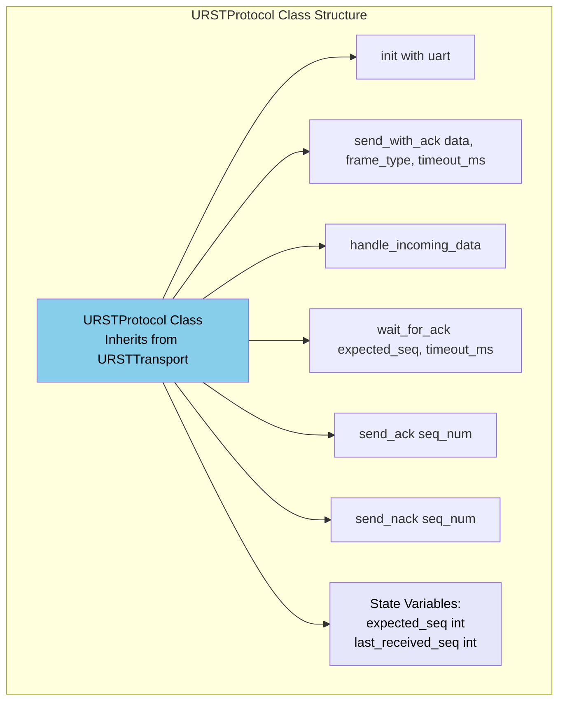
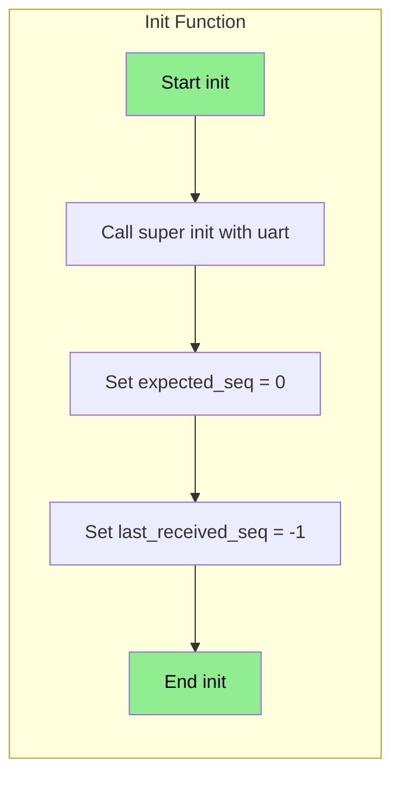
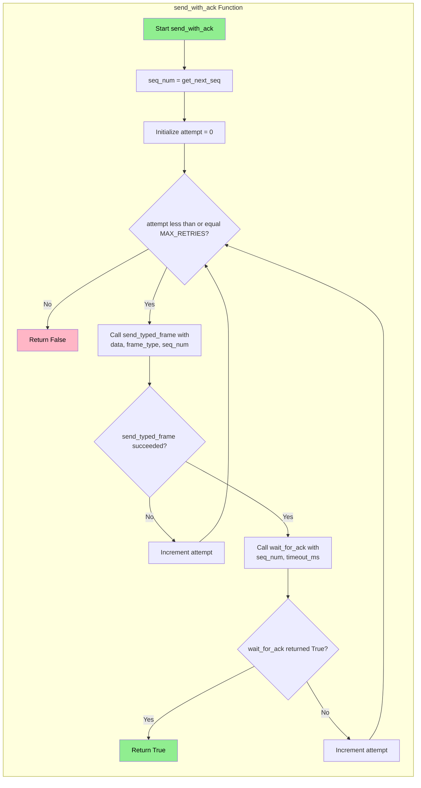
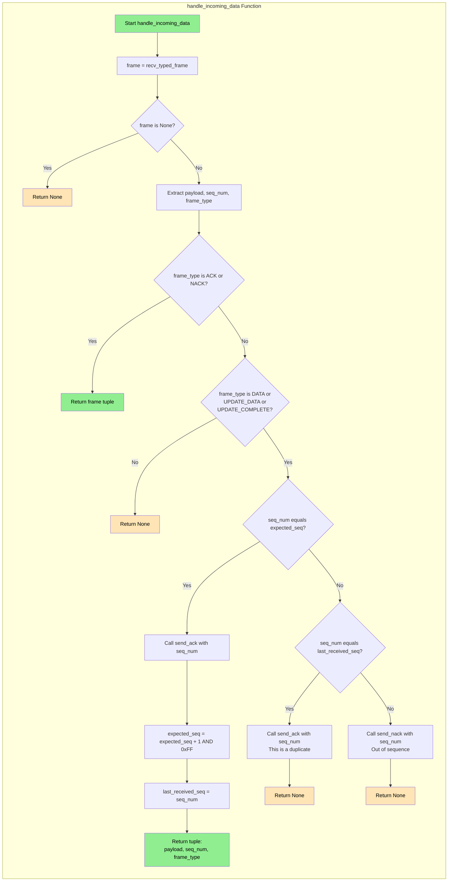
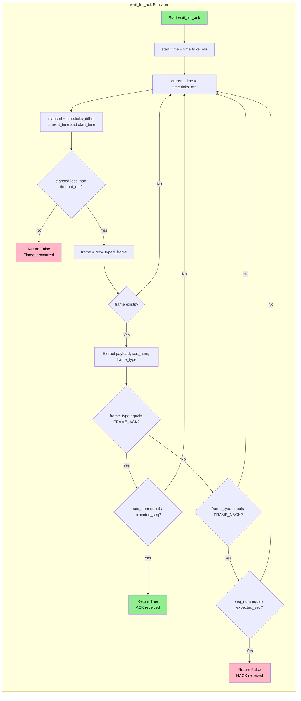
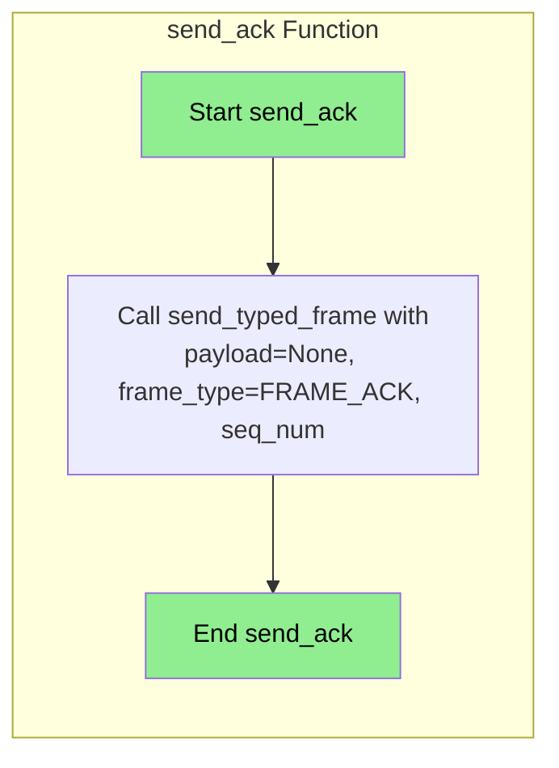

```mermaid
graph TD
    subgraph ClassStructure[URSTProtocol Class Structure]
        Class[URSTProtocol Class<br/>Inherits from URSTTransport]
        Class --> InitMethod[init with uart]
        Class --> SendAckMethod[send_with_ack data, frame_type, timeout_ms]
        Class --> HandleMethod[handle_incoming_data]
        Class --> WaitMethod[wait_for_ack expected_seq, timeout_ms]
        Class --> SendAckFunc[send_ack seq_num]
        Class --> SendNackFunc[send_nack seq_num]

        Class --> StateVars[State Variables:<br/>expected_seq int<br/>last_received_seq int]
    end
    style Class fill:#87CEEB,color:#000000
    style StateVars fill:#E6E6FA,color:#000000
```

```mermaid
flowchart BT
    subgraph Init[Init Function]
        I1[Start init] --> I2[Call super init with uart]
        I2 --> I3[Set expected_seq = 0]
        I3 --> I4[Set last_received_seq = -1]
        I4 --> I5[End init]
    end
    style I1 fill:#90EE90,color:#000000
    style I5 fill:#90EE90,color:#000000
```

```mermaid
flowchart BT
    subgraph SendWithAck[send_with_ack Function]
        SA1[Start send_with_ack] --> SA2[seq_num = get_next_seq]
        SA2 --> SA3[Initialize attempt = 0]
        SA3 --> SA4{attempt less than or equal MAX_RETRIES?}
        SA4 -->|No| SA5[Return False]
        SA4 -->|Yes| SA6[Call send_typed_frame with<br/>data, frame_type, seq_num]
        SA6 --> SA7{send_typed_frame succeeded?}
        SA7 -->|No| SA8[Increment attempt]
        SA8 --> SA4
        SA7 -->|Yes| SA9[Call wait_for_ack with<br/>seq_num, timeout_ms]
        SA9 --> SA10{wait_for_ack returned True?}
        SA10 -->|Yes| SA11[Return True]
        SA10 -->|No| SA12[Increment attempt]
        SA12 --> SA4
    end
    style SA1 fill:#90EE90,color:#000000
    style SA5 fill:#FFB6C6,color:#000000
    style SA11 fill:#90EE90,color:#000000
```

```mermaid
flowchart BT
    subgraph HandleIncoming[handle_incoming_data Function]
        HI1[Start handle_incoming_data] --> HI2[frame = recv_typed_frame]
        HI2 --> HI3{frame is None?}
        HI3 -->|Yes| HI4[Return None]
        HI3 -->|No| HI5[Extract payload, seq_num, frame_type]
        HI5 --> HI6{frame_type is ACK or NACK?}
        HI6 -->|Yes| HI7[Return frame tuple]
        HI6 -->|No| HI8{frame_type is DATA or<br/>UPDATE_DATA or<br/>UPDATE_COMPLETE?}
        HI8 -->|No| HI9[Return None]
        HI8 -->|Yes| HI10{seq_num equals expected_seq?}
        HI10 -->|Yes| HI11[Call send_ack with seq_num]
        HI11 --> HI12[expected_seq = expected_seq + 1 AND 0xFF]
        HI12 --> HI13[last_received_seq = seq_num]
        HI13 --> HI14[Return tuple:<br/>payload, seq_num, frame_type]
        HI10 -->|No| HI15{seq_num equals last_received_seq?}
        HI15 -->|Yes| HI16[Call send_ack with seq_num<br/>This is a duplicate]
        HI16 --> HI17[Return None]
        HI15 -->|No| HI18[Call send_nack with seq_num<br/>Out of sequence]
        HI18 --> HI19[Return None]
    end
    style HI1 fill:#90EE90,color:#000000
    style HI4 fill:#FFE4B5,color:#000000
    style HI7 fill:#90EE90,color:#000000
    style HI9 fill:#FFE4B5,color:#000000
    style HI14 fill:#90EE90,color:#000000
    style HI17 fill:#FFE4B5,color:#000000
    style HI19 fill:#FFE4B5,color:#000000
```

```mermaid
flowchart BT
    subgraph WaitForAck[wait_for_ack Function]
        WA1[Start wait_for_ack] --> WA2[start_time = time.ticks_ms]
        WA2 --> WA3[current_time = time.ticks_ms]
        WA3 --> WA4[elapsed = time.ticks_diff of<br/>current_time and start_time]
        WA4 --> WA5{elapsed less than timeout_ms?}
        WA5 -->|No| WA6[Return False<br/>Timeout occurred]
        WA5 -->|Yes| WA7[frame = recv_typed_frame]
        WA7 --> WA8{frame exists?}
        WA8 -->|No| WA3
        WA8 -->|Yes| WA9[Extract payload, seq_num, frame_type]
        WA9 --> WA10{frame_type equals FRAME_ACK?}
        WA10 -->|Yes| WA11{seq_num equals expected_seq?}
        WA11 -->|Yes| WA12[Return True<br/>ACK received]
        WA11 -->|No| WA3
        WA10 -->|No| WA13{frame_type equals FRAME_NACK?}
        WA13 -->|Yes| WA14{seq_num equals expected_seq?}
        WA14 -->|Yes| WA15[Return False<br/>NACK received]
        WA14 -->|No| WA3
        WA13 -->|No| WA3
    end
    style WA1 fill:#90EE90,color:#000000
    style WA6 fill:#FFB6C6,color:#000000
    style WA12 fill:#90EE90,color:#000000
    style WA15 fill:#FFB6C6,color:#000000
```

```mermaid
flowchart BT
    subgraph SendAck[send_ack Function]
        SACK1[Start send_ack] --> SACK2[Call send_typed_frame with<br/>payload=None, frame_type=FRAME_ACK, seq_num]
        SACK2 --> SACK3[End send_ack]
    end
    style SACK1 fill:#90EE90,color:#000000
    style SACK3 fill:#90EE90,color:#000000
```

```mermaid
flowchart BT
    subgraph SendNack[send_nack Function]
        SNACK1[Start send_nack] --> SNACK2[Call send_typed_frame with<br/>payload=None, frame_type=FRAME_NACK, seq_num]
        SNACK2 --> SNACK3[End send_nack]
    end
    style SNACK1 fill:#90EE90,color:#000000
    style SNACK3 fill:#90EE90,color:#000000
```
