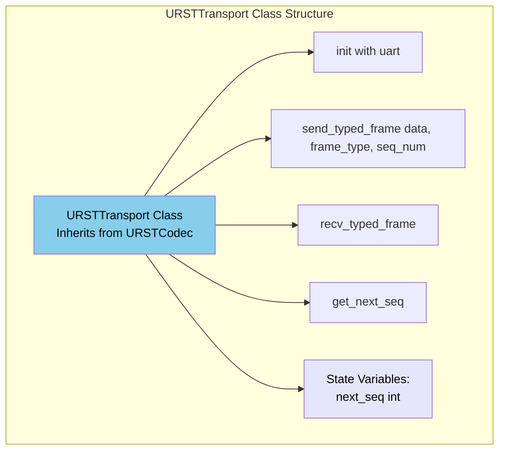
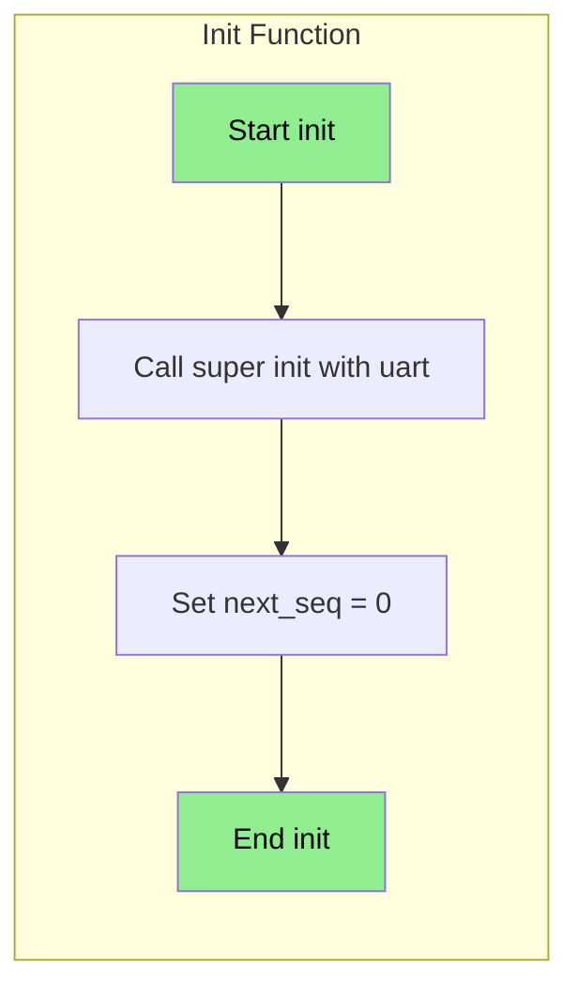
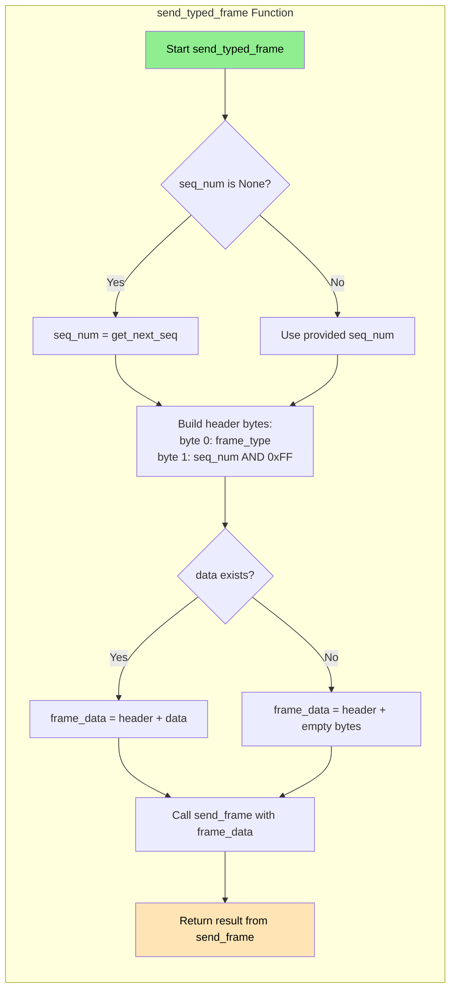
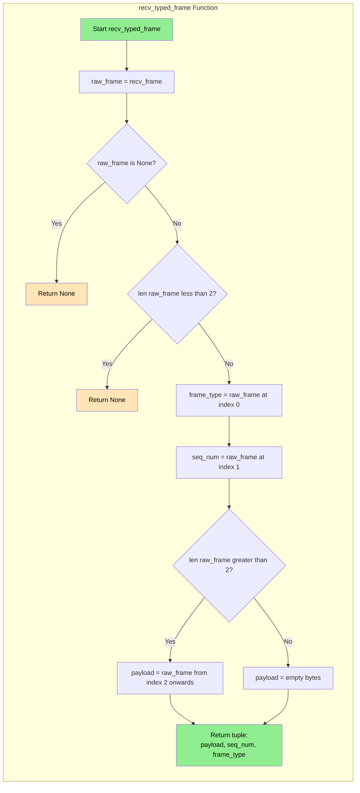
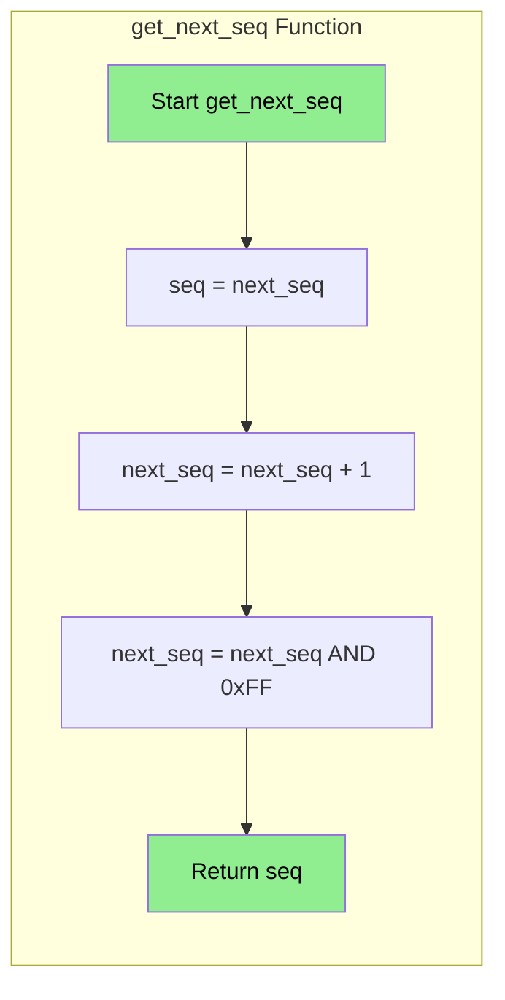

```mermaid
graph TD
    subgraph ClassStructure[URSTTransport Class Structure]
        Class[URSTTransport Class<br/>Inherits from URSTCodec]
        Class --> InitMethod[init with uart]
        Class --> SendTypedMethod[send_typed_frame data, frame_type, seq_num]
        Class --> RecvTypedMethod[recv_typed_frame]
        Class --> GetSeqMethod[get_next_seq]

        Class --> StateVars[State Variables:<br/>next_seq int]
    end
    style Class fill:#87CEEB,color:#000000
    style StateVars fill:#E6E6FA,color:#000000
```

```mermaid
flowchart BT
    subgraph Init[Init Function]
        I1[Start init] --> I2[Call super init with uart]
        I2 --> I3[Set next_seq = 0]
        I3 --> I4[End init]
    end
    style I1 fill:#90EE90,color:#000000
    style I4 fill:#90EE90,color:#000000
```

```mermaid
flowchart BT
    subgraph SendTyped[send_typed_frame Function]
        ST1[Start send_typed_frame] --> ST2{seq_num is None?}
        ST2 -->|Yes| ST3[seq_num = get_next_seq]
        ST2 -->|No| ST4[Use provided seq_num]
        ST3 --> ST5[Build header bytes:<br/>byte 0: frame_type<br/>byte 1: seq_num AND 0xFF]
        ST4 --> ST5
        ST5 --> ST6{data exists?}
        ST6 -->|Yes| ST7[frame_data = header + data]
        ST6 -->|No| ST8[frame_data = header + empty bytes]
        ST7 --> ST9[Call send_frame with frame_data]
        ST8 --> ST9
        ST9 --> ST10[Return result from send_frame]
    end
    style ST1 fill:#90EE90,color:#000000
    style ST10 fill:#FFE4B5,color:#000000
```

```mermaid
flowchart BT
    subgraph RecvTyped[recv_typed_frame Function]
        RT1[Start recv_typed_frame] --> RT2[raw_frame = recv_frame]
        RT2 --> RT3{raw_frame is None?}
        RT3 -->|Yes| RT4[Return None]
        RT3 -->|No| RT5{len raw_frame less than 2?}
        RT5 -->|Yes| RT6[Return None]
        RT5 -->|No| RT7[frame_type = raw_frame at index 0]
        RT7 --> RT8[seq_num = raw_frame at index 1]
        RT8 --> RT9{len raw_frame greater than 2?}
        RT9 -->|Yes| RT10[payload = raw_frame from index 2 onwards]
        RT9 -->|No| RT11[payload = empty bytes]
        RT10 --> RT12[Return tuple:<br/>payload, seq_num, frame_type]
        RT11 --> RT12
    end
    style RT1 fill:#90EE90,color:#000000
    style RT4 fill:#FFE4B5,color:#000000
    style RT6 fill:#FFE4B5,color:#000000
    style RT12 fill:#90EE90,color:#000000
```

```mermaid
flowchart BT
    subgraph GetSeq[get_next_seq Function]
        GS1[Start get_next_seq] --> GS2[seq = next_seq]
        GS2 --> GS3[next_seq = next_seq + 1]
        GS3 --> GS4[next_seq = next_seq AND 0xFF]
        GS4 --> GS5[Return seq]
    end
    style GS1 fill:#90EE90,color:#000000
    style GS5 fill:#90EE90,color:#000000
```
