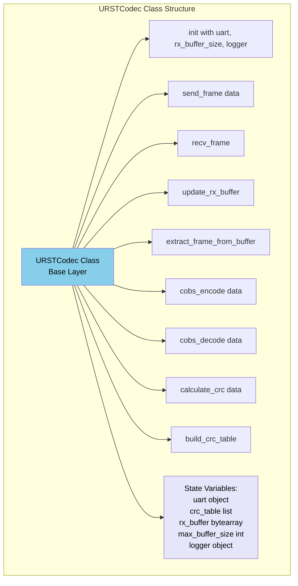
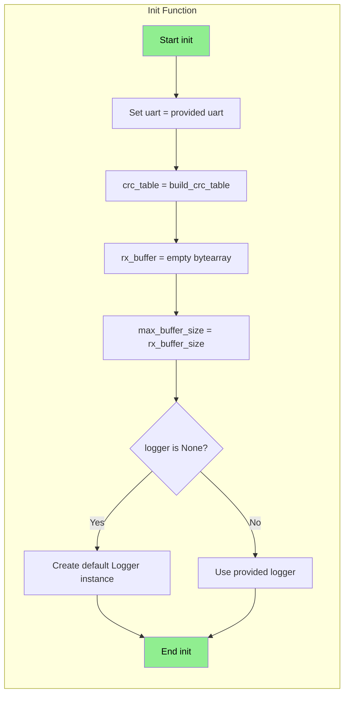
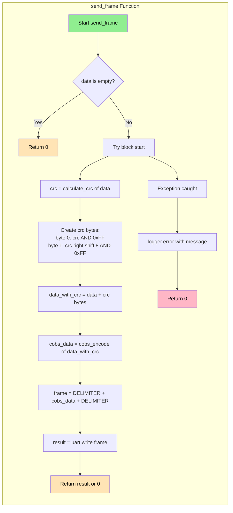
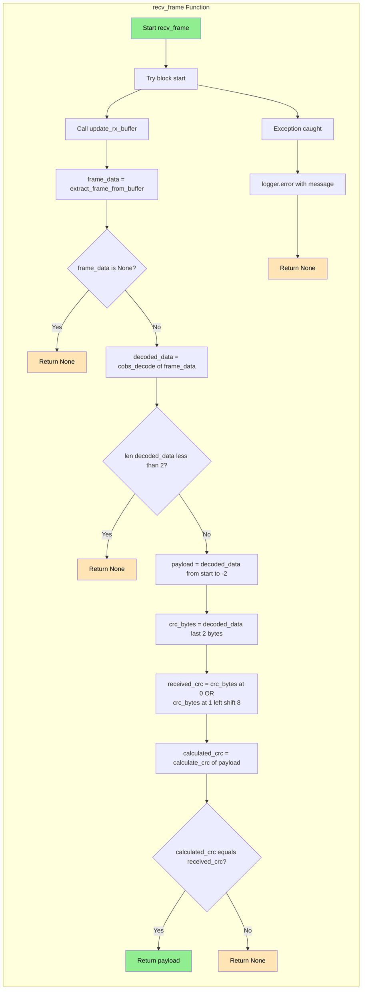
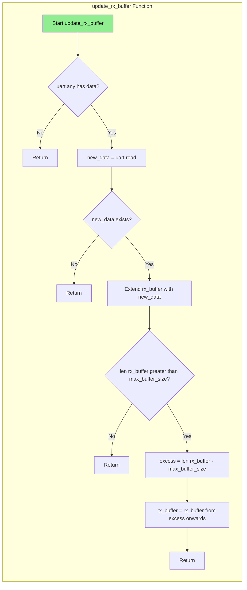
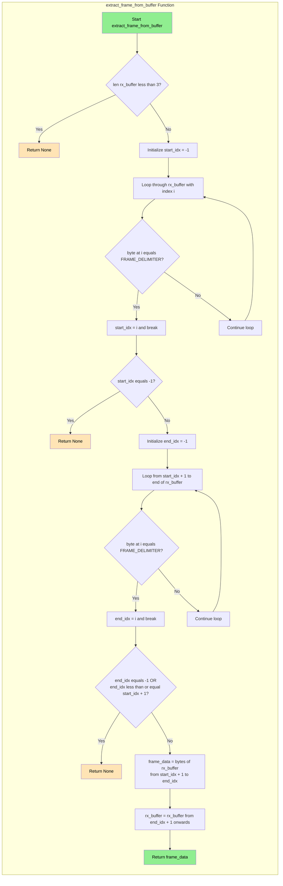
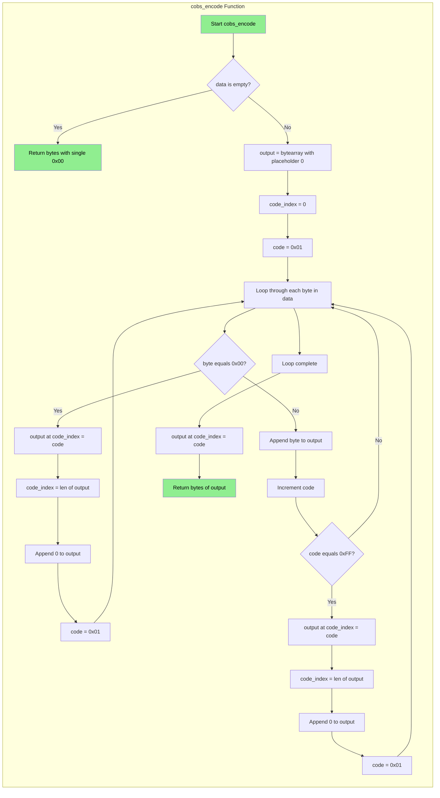
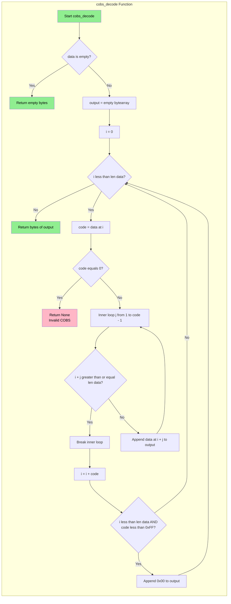
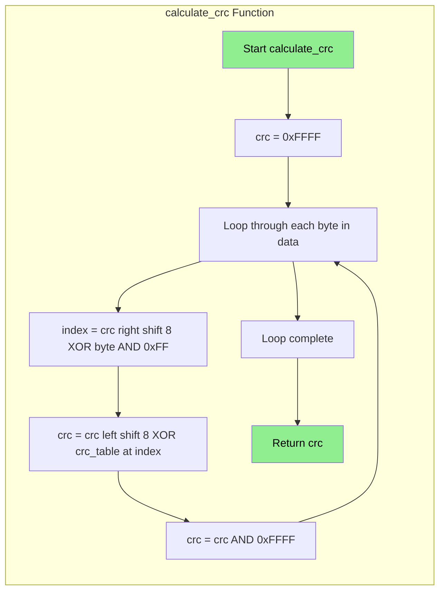
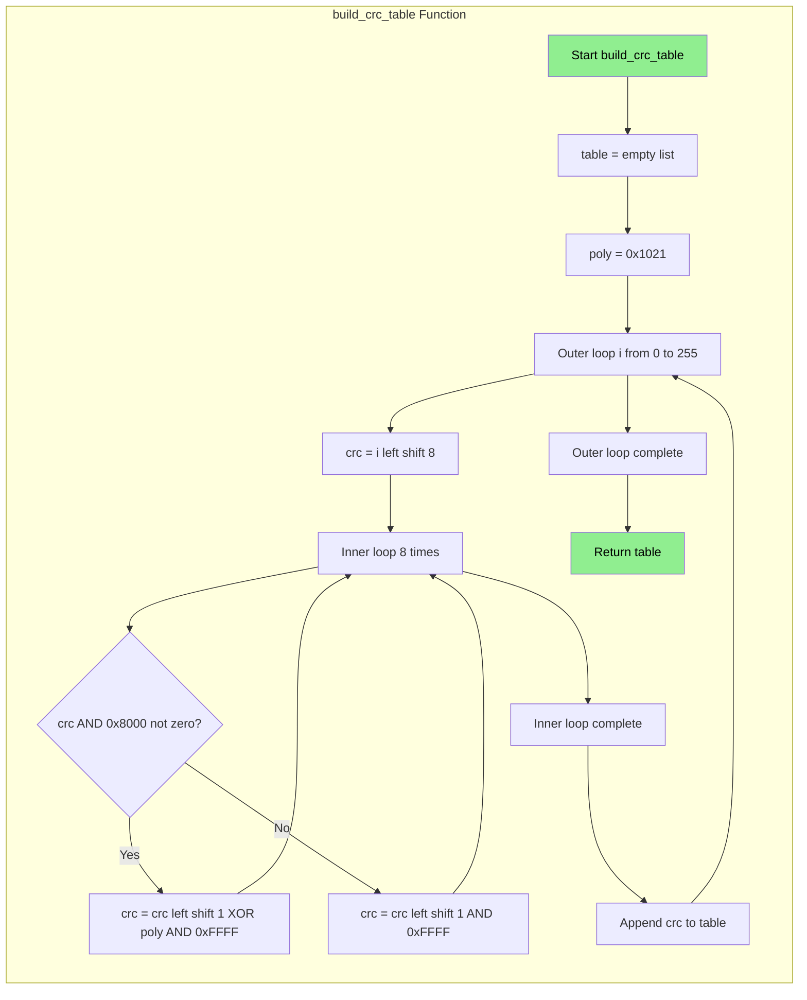

```mermaid
graph TD
    subgraph ClassStructure[URSTCodec Class Structure]
        Class[URSTCodec Class<br/>Base Layer]
        Class --> InitMethod[init with uart, rx_buffer_size, logger]
        Class --> SendFrameMethod[send_frame data]
        Class --> RecvFrameMethod[recv_frame]
        Class --> UpdateRxMethod[update_rx_buffer]
        Class --> ExtractMethod[extract_frame_from_buffer]
        Class --> CobsEncMethod[cobs_encode data]
        Class --> CobsDecMethod[cobs_decode data]
        Class --> CalcCrcMethod[calculate_crc data]
        Class --> BuildCrcMethod[build_crc_table]

        Class --> StateVars[State Variables:<br/>uart object<br/>crc_table list<br/>rx_buffer bytearray<br/>max_buffer_size int<br/>logger object]
    end
    style Class fill:#87CEEB,color:#000000
    style StateVars fill:#E6E6FA,color:#000000
```

```mermaid
flowchart BT
    subgraph Init[Init Function]
        I1[Start init] --> I2[Set uart = provided uart]
        I2 --> I3[crc_table = build_crc_table]
        I3 --> I4[rx_buffer = empty bytearray]
        I4 --> I5[max_buffer_size = rx_buffer_size]
        I5 --> I6{logger is None?}
        I6 -->|Yes| I7[Create default Logger instance]
        I6 -->|No| I8[Use provided logger]
        I7 --> I9[End init]
        I8 --> I9
    end
    style I1 fill:#90EE90,color:#000000
    style I9 fill:#90EE90,color:#000000
```

```mermaid
flowchart BT
    subgraph SendFrame[send_frame Function]
        SF1[Start send_frame] --> SF2{data is empty?}
        SF2 -->|Yes| SF3[Return 0]
        SF2 -->|No| SF4[Try block start]
        SF4 --> SF5[crc = calculate_crc of data]
        SF5 --> SF6[Create crc bytes:<br/>byte 0: crc AND 0xFF<br/>byte 1: crc right shift 8 AND 0xFF]
        SF6 --> SF7[data_with_crc = data + crc bytes]
        SF7 --> SF8[cobs_data = cobs_encode of data_with_crc]
        SF8 --> SF9[frame = DELIMITER + cobs_data + DELIMITER]
        SF9 --> SF10[result = uart.write frame]
        SF10 --> SF11[Return result or 0]
        SF4 --> SF12[Exception caught]
        SF12 --> SF13[logger.error with message]
        SF13 --> SF14[Return 0]
    end
    style SF1 fill:#90EE90,color:#000000
    style SF3 fill:#FFE4B5,color:#000000
    style SF11 fill:#FFE4B5,color:#000000
    style SF14 fill:#FFB6C6,color:#000000
```

```mermaid
flowchart BT
    subgraph RecvFrame[recv_frame Function]
        RF1[Start recv_frame] --> RF2[Try block start]
        RF2 --> RF3[Call update_rx_buffer]
        RF3 --> RF4[frame_data = extract_frame_from_buffer]
        RF4 --> RF5{frame_data is None?}
        RF5 -->|Yes| RF6[Return None]
        RF5 -->|No| RF7[decoded_data = cobs_decode of frame_data]
        RF7 --> RF8{len decoded_data less than 2?}
        RF8 -->|Yes| RF9[Return None]
        RF8 -->|No| RF10[payload = decoded_data from start to -2]
        RF10 --> RF11[crc_bytes = decoded_data last 2 bytes]
        RF11 --> RF12[received_crc = crc_bytes at 0 OR<br/>crc_bytes at 1 left shift 8]
        RF12 --> RF13[calculated_crc = calculate_crc of payload]
        RF13 --> RF14{calculated_crc equals received_crc?}
        RF14 -->|Yes| RF15[Return payload]
        RF14 -->|No| RF16[Return None]
        RF2 --> RF17[Exception caught]
        RF17 --> RF18[logger.error with message]
        RF18 --> RF19[Return None]
    end
    style RF1 fill:#90EE90,color:#000000
    style RF6 fill:#FFE4B5,color:#000000
    style RF9 fill:#FFE4B5,color:#000000
    style RF15 fill:#90EE90,color:#000000
    style RF16 fill:#FFE4B5,color:#000000
    style RF19 fill:#FFE4B5,color:#000000
```

```mermaid
flowchart BT
    subgraph UpdateRx[update_rx_buffer Function]
        UR1[Start update_rx_buffer] --> UR2{uart.any has data?}
        UR2 -->|No| UR3[Return]
        UR2 -->|Yes| UR4[new_data = uart.read]
        UR4 --> UR5{new_data exists?}
        UR5 -->|No| UR6[Return]
        UR5 -->|Yes| UR7[Extend rx_buffer with new_data]
        UR7 --> UR8{len rx_buffer greater than max_buffer_size?}
        UR8 -->|No| UR9[Return]
        UR8 -->|Yes| UR10[excess = len rx_buffer - max_buffer_size]
        UR10 --> UR11[rx_buffer = rx_buffer from excess onwards]
        UR11 --> UR12[Return]
    end
    style UR1 fill:#90EE90,color:#000000
```

```mermaid
flowchart BT
    subgraph ExtractFrame[extract_frame_from_buffer Function]
        EF1[Start extract_frame_from_buffer] --> EF2{len rx_buffer less than 3?}
        EF2 -->|Yes| EF3[Return None]
        EF2 -->|No| EF4[Initialize start_idx = -1]
        EF4 --> EF5[Loop through rx_buffer with index i]
        EF5 --> EF6{byte at i equals FRAME_DELIMITER?}
        EF6 -->|Yes| EF7[start_idx = i and break]
        EF6 -->|No| EF8[Continue loop]
        EF8 --> EF5
        EF7 --> EF9{start_idx equals -1?}
        EF9 -->|Yes| EF10[Return None]
        EF9 -->|No| EF11[Initialize end_idx = -1]
        EF11 --> EF12[Loop from start_idx + 1 to end of rx_buffer]
        EF12 --> EF13{byte at i equals FRAME_DELIMITER?}
        EF13 -->|Yes| EF14[end_idx = i and break]
        EF13 -->|No| EF15[Continue loop]
        EF15 --> EF12
        EF14 --> EF16{end_idx equals -1 OR<br/>end_idx less than or equal start_idx + 1?}
        EF16 -->|Yes| EF17[Return None]
        EF16 -->|No| EF18[frame_data = bytes of rx_buffer<br/>from start_idx + 1 to end_idx]
        EF18 --> EF19[rx_buffer = rx_buffer from end_idx + 1 onwards]
        EF19 --> EF20[Return frame_data]
    end
    style EF1 fill:#90EE90,color:#000000
    style EF3 fill:#FFE4B5,color:#000000
    style EF10 fill:#FFE4B5,color:#000000
    style EF17 fill:#FFE4B5,color:#000000
    style EF20 fill:#90EE90,color:#000000
```

```mermaid
flowchart BT
    subgraph CobsEnc[cobs_encode Function]
        CE1[Start cobs_encode] --> CE2{data is empty?}
        CE2 -->|Yes| CE3[Return bytes with single 0x00]
        CE2 -->|No| CE4[output = bytearray with placeholder 0]
        CE4 --> CE5[code_index = 0]
        CE5 --> CE6[code = 0x01]
        CE6 --> CE7[Loop through each byte in data]
        CE7 --> CE8{byte equals 0x00?}
        CE8 -->|Yes| CE9[output at code_index = code]
        CE9 --> CE10[code_index = len of output]
        CE10 --> CE11[Append 0 to output]
        CE11 --> CE12[code = 0x01]
        CE12 --> CE7
        CE8 -->|No| CE13[Append byte to output]
        CE13 --> CE14[Increment code]
        CE14 --> CE15{code equals 0xFF?}
        CE15 -->|Yes| CE16[output at code_index = code]
        CE16 --> CE17[code_index = len of output]
        CE17 --> CE18[Append 0 to output]
        CE18 --> CE19[code = 0x01]
        CE19 --> CE7
        CE15 -->|No| CE7
        CE7 --> CE20[Loop complete]
        CE20 --> CE21[output at code_index = code]
        CE21 --> CE22[Return bytes of output]
    end
    style CE1 fill:#90EE90,color:#000000
    style CE3 fill:#90EE90,color:#000000
    style CE22 fill:#90EE90,color:#000000
```

```mermaid
flowchart BT
    subgraph CobsDec[cobs_decode Function]
        CD1[Start cobs_decode] --> CD2{data is empty?}
        CD2 -->|Yes| CD3[Return empty bytes]
        CD2 -->|No| CD4[output = empty bytearray]
        CD4 --> CD5[i = 0]
        CD5 --> CD6{i less than len data?}
        CD6 -->|No| CD7[Return bytes of output]
        CD6 -->|Yes| CD8[code = data at i]
        CD8 --> CD9{code equals 0?}
        CD9 -->|Yes| CD10[Return None<br/>Invalid COBS]
        CD9 -->|No| CD11[Inner loop j from 1 to code - 1]
        CD11 --> CD12{i + j greater than or equal len data?}
        CD12 -->|Yes| CD13[Break inner loop]
        CD12 -->|No| CD14[Append data at i + j to output]
        CD14 --> CD11
        CD13 --> CD15[i = i + code]
        CD15 --> CD16{i less than len data AND<br/>code less than 0xFF?}
        CD16 -->|Yes| CD17[Append 0x00 to output]
        CD17 --> CD6
        CD16 -->|No| CD6
    end
    style CD1 fill:#90EE90,color:#000000
    style CD3 fill:#90EE90,color:#000000
    style CD7 fill:#90EE90,color:#000000
    style CD10 fill:#FFB6C6,color:#000000
```

```mermaid
flowchart BT
    subgraph CalcCrc[calculate_crc Function]
        CC1[Start calculate_crc] --> CC2[crc = 0xFFFF]
        CC2 --> CC3[Loop through each byte in data]
        CC3 --> CC4[index = crc right shift 8 XOR byte AND 0xFF]
        CC4 --> CC5[crc = crc left shift 8 XOR crc_table at index]
        CC5 --> CC6[crc = crc AND 0xFFFF]
        CC6 --> CC3
        CC3 --> CC7[Loop complete]
        CC7 --> CC8[Return crc]
    end
    style CC1 fill:#90EE90,color:#000000
    style CC8 fill:#90EE90,color:#000000
```

```mermaid
flowchart BT
    subgraph BuildCrc[build_crc_table Function]
        BC1[Start build_crc_table] --> BC2[table = empty list]
        BC2 --> BC3[poly = 0x1021]
        BC3 --> BC4[Outer loop i from 0 to 255]
        BC4 --> BC5[crc = i left shift 8]
        BC5 --> BC6[Inner loop 8 times]
        BC6 --> BC7{crc AND 0x8000 not zero?}
        BC7 -->|Yes| BC8[crc = crc left shift 1 XOR poly AND 0xFFFF]
        BC7 -->|No| BC9[crc = crc left shift 1 AND 0xFFFF]
        BC8 --> BC6
        BC9 --> BC6
        BC6 --> BC10[Inner loop complete]
        BC10 --> BC11[Append crc to table]
        BC11 --> BC4
        BC4 --> BC12[Outer loop complete]
        BC12 --> BC13[Return table]
    end
    style BC1 fill:#90EE90,color:#000000
    style BC13 fill:#90EE90,color:#000000
```
